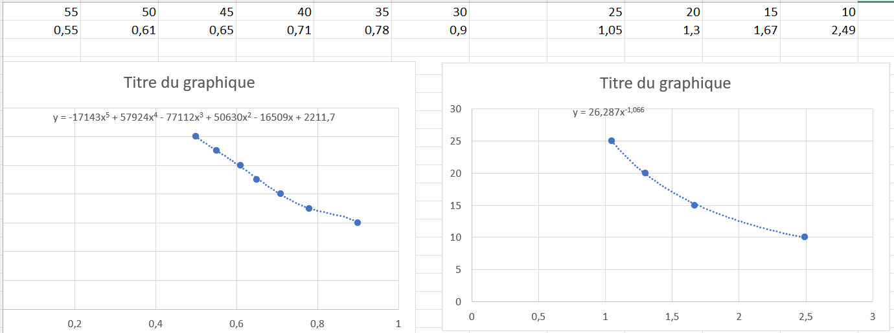

# Pendant la séance

- Création d'un fichier `constants.h` qui permet de stocker les pins, et les valeurs principales de fonctionnement des moteurs et du servomoteur
- Ecriture d'un module `Moteur` pour gérer le moteur et son fonctionnement
- Ecriture d'un module `Infrared` qui permet de mesurer la tension de sortie du capteur ultrason et le convertir en mesure
- Ecriture d'un module `Servomoteur` qui gère la rotation du servomoteur pour orienter la caméra
- Ecriture d'un module `Robot` qui initialise et gère les deux moteurs, le servomoteur et le capteur
- Calibration du module infrarouge pour trouver la distance en fonction de la tension de sortie

