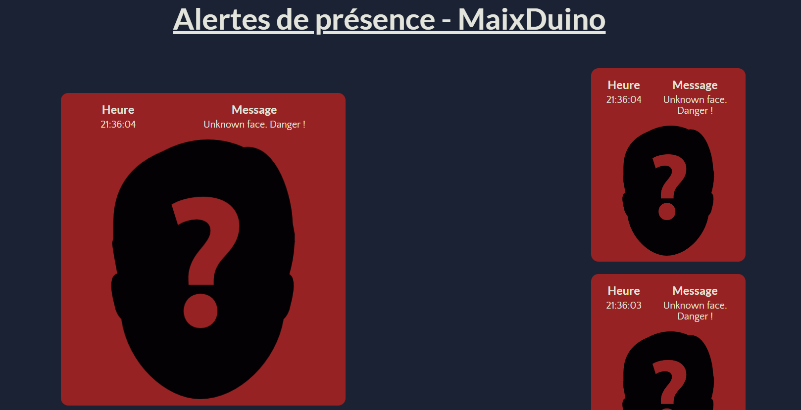
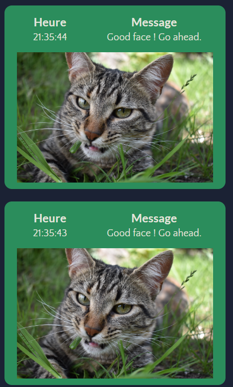

# Avant la séance

- Test de capacité d'envoi de flux vidéo : après discussion avec Loïc, nous avons décidé d'envoyer uniquement les images des visages capturés
- Création d'un serveur Flask sur l'ordinateur pour recevoir les données depuis la MaixDuino
- Test d'envoi de sockets d'exemple pour tester la configuration
- Configuration du module WiFi de la MaixDuino. 
- Création des styles CSS ainsi que les scripts Javascript nécessaires pour afficher correctement l'interface de retour sur l'ordinateur

# Pendant la séance

- Nous avons remarqué lors de nos tests avant séance que les échanges réseaux étaient instables et après discussion avec
M. Rallo, nous avons décidé d'envoyer le nom de la personne correspondant au visage plutôt que l'image elle-même et enregistrer
des images de référence au niveau de l'ordinateur. → Adaptation du code de la MaixDuino pour changer les données envoyées et du serveur
Flask pour récupérer et afficher les bonnes informations
- Création d'un système de base de données SQLite pour enregistrer les données reçues par socket et pouvoir les récupérer pour le serveur Flask
- Tests du système avec différents visages
- Discussion avec Loïc concernant la pertinence de garder toutes les alertes à chaque démarrage du robot pour constituer un historique complet
→ implémentation de cette idée sous forme d'une autre interface sur le serveur Flask prochainement

## Design travaillé de l'interface

