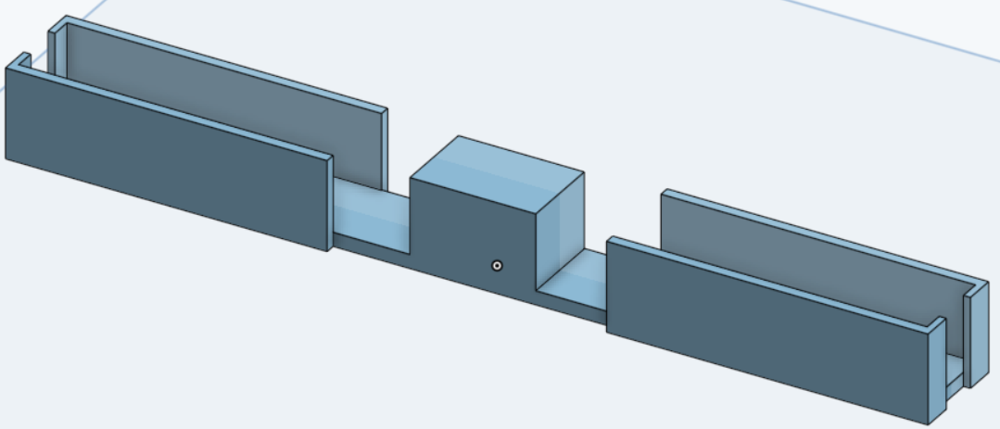
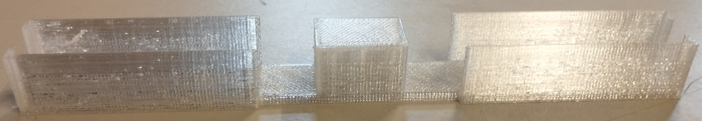

# Avant séance

- Ajout d'images de référence (test) dans le dossier `images/` de l'interface
- Changement du style de la partie historique de l'interface
- Organisation du code de l'interface web
- Structuration du code CSS de l'ensemble de l'interface
- Création et implémentation du style d'une nouvelle page de l'interface permettant de supprimer une ou plusieurs alertes de l'historique complet
- Modification du système de rafraîchissement automatique de l'interface (mais ne fonctionne pas toujours → à revoir)
- Assemblage de la structure du robot avec Loïc
    - Assemblage des plaques en bois précédemment découpées
    - Ajout de tiges filetées (après découpe et ponçage), ainsi que d'entretoises pour fixer l'ensemble 
  
# Pendant la séance

- Prise de mesure avec Loïc des différentes cartes, du moteur et du servomoteur pour modéliser et assembler le robot
- Modélisation et impression d'une plaque en plexiglas pour fixer la carte MaixDuino au servomoteur
- Modélisation et impression d'une pièce en plastique pour tenir les moteurs ensemble et les fixer sous la structure

- Résolution d'un problème inopiné d'envoi de données WiFi entre la carte MaixDuino et l'ordinateur 